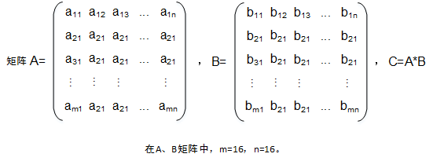
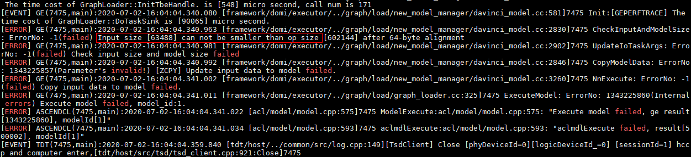
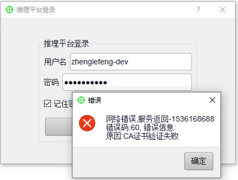
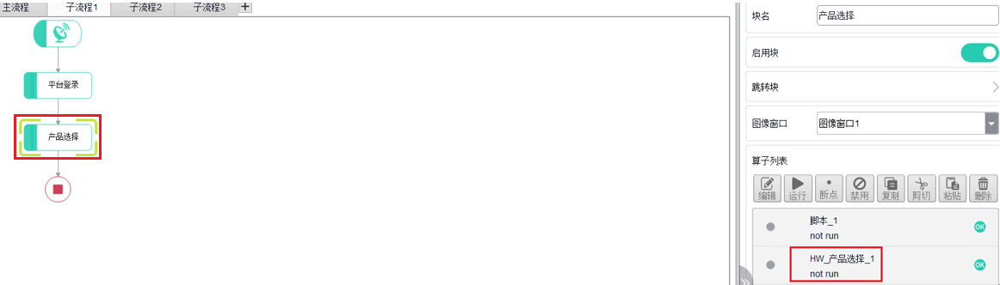
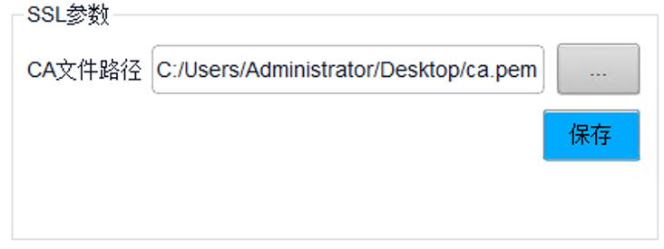

# XXX简介

这一章的标题并不是固定就叫“XXX简介”，可以根据实际业务情况定标题，但目标是为了一上来先让用户了解要接触的东西是什么，介绍XXX，可包含以下几部分内容：

1.  描述什么是XXX
2.  XXX在整体架构中处于什么位置
3.  XXX的使用场景是什么
4.  使用XXX的优势有哪些
5.  （可选）基本概念

    介绍本领域开发过程中通用的关键概念，若是具体特性相关的概念，不放在此处，要放在具体特性介绍的地方。若描述的文字比较多，此处可以尽量以图、表格的形式呈现。

    对于昇腾通用的概念（例如Ascend EP），若昇腾术语表中已存在，那么也不在此处介绍。

6.  （可选）如果文档内容比较多的情况下，还可以在最后说明下通过本文档学习XXX的一个推荐路径。

    在推荐的学习路径中加一下参见安装的入口。

7.  （可选）总体的使用约束、使用说明，例如支持的芯片范围。

**写作示例：**`https://www.hiascend.com/document/detail/zh/canncommercial/82RC1/appdevg/acldevg/aclcppdevg_000000.html`

# （可选）准备环境

如果是安装好固件、驱动、CANN就可以使用XXX，那么就不需要“准备环境”这个章节，没有“准备环境”章节时，可在“XXX简介”章节中增加参见安装指南的入口、在“快速入门”章节中也增加参见安装指南的入口。。

若除了安装固件、驱动、CANN之外，还有额外要安装的包、要配置的环境变量等，则需保留“准备环境”章节，安装固件、驱动、CANN的部分参见CANN安装指南，其它内容要写出具体的安装、配置步骤。

**写作示例：**`https://www.hiascend.com/document/detail/zh/canncommercial/82RC1/appdevg/acldevg/aclcppdevg_01_0004.html`

# （可选）快速入门

**可选**，有的开发指南本身比较简单，功能也好理解的情况下，没有这个快速入门也可以。基于各业务场景，需自行讨论快速入门的内容定位，并在快速入门最前面需要描述下内容定位。

**获取样例**

说明这个样例实现一个什么样的功能，输入、输出是什么等等，图示说明也可以。另外，还需要说明样例下载链接（PS：如果代码简短，直接通过文档承载的，那就不需要提供下载路径）。

**写作示例**：暂无。

**编译运行**

1.  准备环境。

    给出安装环境的步骤，或者给出参见哪本手册安装环境。

2.  （可选）配置环境变量。

    除了安装时配置的环境变量，如果还有跟当前编译运行强相关的环境变量，则需要在这里说明。

3.  编译代码。

    写出编译运行脚本的执行方法。

4.  运行应用。

    给出结果示例。

**写作示例**，可参考该样例的readme组织内容：`https://gitee.com/ascend/samples/tree/master/cplusplus/level2_simple_inference/1_classification/resnet50_imagenet_classification`

**代码解析**

介绍关键代码逻辑 用到的概念就在解析的地方一并解释。

**写作示例：**

`https://www.hiascend.com/document/detail/zh/canncommercial/82RC1/opdevg/Ascendcopdevg/atlas\_ascendc\_10\_0006.html`

**后续学习**

如果有单独的学习向导章节，就不需要这个section了，如果没有的话，可以在快速入门后说明下还有哪些建议学习的内容。（PS：这里可以讨论下，对于内容多、层次深的文档，看看有没有必要在这里介绍下文档结构，作为用户后续学习的一个简单指引）

1.  XXXX
2.  XXXXX
3.  XXXXX

**写作示例**：暂无。

# 编程接口与调用流程

该章节下的内容，可根据业务实际情况增、删内容，如果子章节内容较多，也可以独立成一级标题。这个章节标题也可由各业务自行定义，例如Ascend C是叫编程模型。

## XXX编程接口

介绍接口的分类原则、命名原则、接口的一些总体使用原则、接口依赖的头文件&库文件等。

**写作示例：**`https://www.hiascend.com/document/detail/zh/canncommercial/82RC1/appdevg/acldevg/aclcppdevg\_000523.html`

## XXX接口调用流程

介绍关键开发步骤、或给出接口调用流程。这个要注意，开发流程中提到的特性/功能要和大纲中的特性/功能名称保持一致。流程如果以图的形式呈现，图上要不要做热点，在图下文字中做跳转，方便后续维护。

**写作示例：**`https://www.hiascend.com/document/detail/zh/canncommercial/82RC1/appdevg/acldevg/aclcppdevg\_000005.html`

# 开发指南正文支持以下两种方式展开

各业务侧根据讨论的情况，自行选择按“按特性或功能”维度展开开发指南的正文，或按照“开发步骤”维度展开开发指南的正文。某个特性或功能或开发步骤作为一级标题，一级标题由各业务自行讨论确定。

这里可以特性或功能维度展开，特性或功能之间是并列关系，当然也可以特性或功能之间串起来使用。这种可以在第4章的接口调用流程章节说明。

## 方式一：以下章节按特性或功能维度介绍

### 特性或功能1

先介绍这个特性或功能是什么，基本原理、使用约束。如果这部分内容少，就需要单独的section，一两句话介绍就可以了；如果这部分内容多，就可以独立成section或章节。

跟这个特性相关的内容，例如概念等等，需要放在特性一起介绍。

**接口调用流程**

如果是需要多个接口配合使用完成一个特性或功能的开发，此处图+字配合描述接口的前后顺序关系，以及开发过程中的注意点。

如果是需要多个子步骤实现一个大步骤的开发，此处图+字配合描述子步骤的前后顺序关系，以及开发过程中的注意点。

section标题此处仅供参考，可由业务侧自定义。

**示例代码**

以伪代码形式，代码+注释配合描述代码逻辑。注意，示例代码要用screen标记，并将codetype设置为对应语言。

```
// 1. XXXXXXX
xxxxxxxxxxxxxxxxxxxxxxxxx
// 2. XXXXXXX
xxxxxxxxxxxxxxxxxxxxxxxxxxxxxxxxxx
// ......
```

**参考信息**

有辅助理解开发过程的辅助信息等可以放到这里。

**写作示例：**`https://www.hiascend.com/document/detail/zh/canncommercial/82RC1/appdevg/acldevg/aclcppdevg\_000009.html`

### 特性或功能2

先介绍这个特性或功能是什么，基本原理、使用约束。如果这部分内容少，就需要单独的section，一两句话介绍就可以了；如果这部分内容多，就可以独立成section或章节。

然后介绍这个特性的开发过程，按步骤介绍示例代码。如果每个步骤内容多的话，可以独立成section。示例代码要用screen标记，并将codetype设置为对应语言。

**写作示例：**`https://www.hiascend.com/document/detail/zh/canncommercial/82RC1/graph/graphdevg/atlasag\_25\_0026.html`

### 特性或功能3

在不同场景下，开发特性或功能的原理、涉及的接口、代码均有不同，这时，可以分场景介绍，一个场景一个section或一个章节。然后再每个section或章节下，介绍原理、使用约束、示例代码等。示例代码要用screen标记，并将codetype设置为对应语言。

**写作示例：**`https://www.hiascend.com/document/detail/zh/canncommercial/82RC1/appdevg/acldevg/aclcppdevg\_000519.html`

### 更多特性

特性比较多的情况下，主流、关键特性作为一级标题，其它特性作为二级标题收到更多特性中。“其它特性”包含哪些范围，由各业务侧自定义。

#### XXX特性1

#### XXX特性2

## 方式二：以下章节按开发步骤维度介绍


### 开发步骤1

先简述该步骤的作用，然后结合代码具体说明如何开发。如果该步骤下还包括子步骤或子场景，则可以独立成section或章节来介绍。示例代码要用screen标记，并将codetype设置为对应语言。

**写作示例：**

-   Ascend C算子开发

    `https://www.hiascend.com/document/detail/zh/canncommercial/82RC1/opdevg/Ascendcopdevg/atlas\_ascendc\_10\_0031.html`

-   Ascend Graph

    `https://www.hiascend.com/document/detail/zh/canncommercial/82RC1/graph/graphdevg/atlasag\_25\_0024.html`

### 开发步骤2

### 专题

有些开发点可能多处都涉及，但内容比较多、不好串接到某一个开发步骤中，那么可以考虑作为一个小专题收纳到“专题”章节中，但是在开发步骤中要给出入口。

#### XXX专题1

先简述该部分的功能、使用约束，然后结合代码具体说明如何开发。如果该专题包含子场景，则可以独立成section或章节来介绍。示例代码要用screen标记，并将codetype设置为对应语言。

写作示例：

-   Ascend C算子开发

    `https://www.hiascend.com/document/detail/zh/canncommercial/82RC1/opdevg/Ascendcopdevg/atlas\_ascendc\_10\_0090.html`

-   Ascend Graph开发

    `https://www.hiascend.com/document/detail/zh/canncommercial/82RC1/graph/graphdevg/atlasag\_25\_0048.html`

#### XXX专题2

# 精度/性能调优

涉及精度、性能调优的场景，可以在这一章节用图展示调优思路、再结合文字给出操作步骤或示例代码。如果有调优的样例，这边也可以给出参考到样例的链接。示例代码要用screen标记，并将codetype设置为对应语言。

如果有多个精度、性能调优的方式，内容多时，可以独立成section或章节来介绍。

**写作示例：**

-   AscendCL应用开发指南\_性能调优

    `https://www.hiascend.com/document/detail/zh/canncommercial/82RC1/appdevg/acldevg/aclcppdevg\_000109.html`

-   AscendCL应用开发指南\_精度调优

    `https://www.hiascend.com/document/detail/zh/canncommercial/82RC1/appdevg/acldevg/aclcppdevg\_000098.html`

-   TensorFlow 2.6.5模型迁移指南

    `https://www.hiascend.com/document/detail/zh/TensorFlowCommercial/82RC1/migration/tfmigr1/tfmigr1\_tfprecision\_0002.html`

# XXX样例参考

如果样例代码是在sample仓，那资料直接给样例列表，然后参见到sample仓中的readme，就不需要一个个样例使用的子章节了。但这种可能要考虑区分OBP版本与其它版本，不确定是不是所有版本都允许参见到昇腾sample仓。

写作模板：

_Sample名称能准备的体现sample功能，方便用户快速定位。名称示例：_

逐层构建简单的MNIST网络

使用TensorFlow SSD网络进行对象检测

TensorRT中具有动态形状的数字识别

使用Python将Caffe，TensorFlow和ONNX模型导入TensorRT

**功能描述**

_描述此样例实现的主要功能。写作示例：_

该样例主要实现两个矩阵相乘的运算，两个矩阵都是16\*16的矩阵，矩阵中的元素从文件中读取。矩阵乘的结果是一个16\*16的矩阵。

**图 1**  Sample示例  


**样例获取**

_描述该样例如何获取。如果需要使用者额外下载其他文件，例如模型文件与数据文件，此处也需要给出下载路径。写作示例：_

该样例代码所在路径：$HOME/tools/che/ddk/ddk/sample/classify\_net\_asic。

由于Faster-R-CNN网络的权重文件太大，未包含在此样例代码中，使用此样例前，开发者需要从[https://obs-model-ascend.obs.cn-east-2.myhuaweicloud.com/fast\_rcnn/faster\_rcnn.caffemodel](https://obs-model-ascend.obs.cn-east-2.myhuaweicloud.com/fast_rcnn/faster_rcnn.caffemodel)下载权重文件到xxx目录中。

**目录结构**

_描述此样例的代码目录结构，需要对每一个目录中的文件进行介绍。写作示例：_

使用ACL接口调用矩阵乘算子的样例代码的目录结构如下所示：

```
├── src                                 
│   ├── compile_gemm_op.cpp             //将矩阵乘算子编译成.om的实现文件          
│   ├── run_gemm_op.cpp                 //执行矩阵乘运算的实现文件
│   ├── utils.cpp                       //公共函数（例如：文件读取函数）的实现文件
│   ├── CMakeLists.txt                  //编译脚本。
├── inc                                 
│   ├── utils.h                         //定义公共函数（例如：文件读取函数）的头文件                 
├── run
│   ├── out          
│   │   ├──test_data                        
│   │   │   ├── data                           
│   │   │   │     ├── matrix_a.bin            //矩阵A的数据。 
│   │   │   │     ├── matrix_b.bin            //矩阵B的数据。
│   │   ├──result_files                         //存放输出结果
```

**实现原理**

_描述sample实现的流程及技术原理，可以文字描述，也可以流程图+文字描述，根据sample的复杂度自行选择，旨在可以描述sample的实现流程与关键技术点。写作示例：_

该示例实现了MNIST模型（data/samples/mnist/mnist.prototxt），不同之处在于，自定义层使用cuBLAS中的gemm例程（矩阵乘法）和cuDNN中的张量加法（偏差偏移）实现了Caffe InnerProduct层。通常，可以使用IFullyConnected层在TensorRT中实现Caffe InnerProduct层。但是，在此示例中，我们FCPlugin以该层为例来说明如何使用插件。该示例通过IPluginExt接口演示了插件的用法，并使用nvcaffeparser1::IPluginFactoryExt将该插件对象添加到网络，详细实现流程及关键技术点描述如下：

1.  定义网络。

    在FCPlugin重新定义了内积层，其具有一个输出。相应地，getNbOutputs返回1并getOutputDimensions包括验证检查并返回输出的尺寸：

    ```
    Dims getOutputDimensions(int index, const Dims* inputDims, int nbInputDims) override   
    {   
       assert(index == 0 && nbInputDims == 1 &&inputDims[0].nbDims == 3);
       assert(mNbInputChannels == inputDims[0].d[0] * inputDims[0].d[1] *inputDims[0].d[2]);
       return DimsCHW(mNbOutputChannels, 1, 1);   
    }
    ```

2.  在NvCaffeParser中启用自定义层。

    使用Caffe解析器[导入模型](https://docs.nvidia.com/deeplearning/sdk/tensorrt-developer-guide/index.html#import_caffe_c)。要使用FCPluginInnerProduct层的实现，必须定义一个插件工厂，该工厂可以识别InnerProduct层（ip2 Caffe中的内部产品）的名称。

    ```
    bool isPlugin(const char* name) override   
    {  return !strcmp(name, "ip2"); }   
    ```

    然后，工厂可以FCPlugin按照解析器的指示实例化对象。该createPlugin方法接收层名称，以及从Caffe模型文件中提取的一组权重，然后将这些权重传递给插件构造函数。由于权重的生命周期和新创建的插件的生命周期是分离的，因此插件会在构造函数中复制权重的副本。

    ```
    virtual nvinfer1::IPlugin* createPlugin(const char* layerName, const nvinfer1::Weights* weights, int nbWeights) override   
    {       
          ...   
          mPlugin =   std::unique_ptr<FCPlugin>(new FCPlugin(weights,nbWeights));    
          return mPlugin.get();   }
    ```

3.  构造引擎。

    FCPlugin不需要任何暂存空间，因此，对于构建引擎而言，最重要的方法是处理支持的格式和配置。FCPlugin支持两种格式：NCHW，supportsFormat方法中定义的单精度和半精度。

    在构建阶段选择受支持的配置。构建器使用网络configureWithFormat\(\)方法选择配置，从而使其有机会根据其输入选择算法。在此示例中，将检查输入以确保它们采用受支持的格式，并将所选格式记录在成员变量中。在这种简单的情况下，无需存储其他信息。在更复杂的情况下，您可能需要这样做，甚至为给定的配置选择即席算法。

    ```
    void configureWithFormat(..., DataType type, PluginFormat format, ...) override 
    { 
        assert((type == DataType::kFLOAT || type == DataType::kHALF) &&format == PluginFormat::kNCHW);
        mDataType = type;  
    } 
    ```

    配置在构建时进行，因此，在运行时所需的此处确定的任何信息或状态都应存储为插件的成员变量，并进行序列化和反序列化。

4.  序列化和反序列化。

    ……

5.  资源管理和执行。

    ……

**样例运行**

_端到端描述此样例如何运行，并给出运行结果的描述。写作示例_：

1.  修改main.cpp文件中DDK版本号。

    修改Sample目录下的**acl\_custom\_op/src/main.cpp**文件中的**ddkVersion**变量的值为实际的DDK版本号，如下所示：

    ```
    string ddkVersion = "1.33.T1.0.B010";
    ```

    DDK的版本号可通过DDK安装路径下的“/ddk\_info“文件查看获取，如下所示，VERSION字段的值即为当DDK版本。

    ```
    {
        "VERSION": "xx.xx.xx.xx",
        "TYPE": "x86_64.ubuntu16.04",
        "NAME": "DDK",
        "INTERFACE_VERSION": "1.1.1"
    }
    ```

2.  设置环境变量。

    利用export命令，在当前终端下声明环境变量，关闭Shell终端失效。

    其中，DDK\_PATH为DDK安装路径，请根据实际情况替换；NPU\_HOST\_LIB为DDK中存储的Host侧的Lib库的路径。

    ```
    export DDK_PATH=/home/ddk_installer/ddk
    export NPU_HOST_LIB=$DDK_PATH/host/lib
    ```

3.  编译单算子验证代码，生成单算子验证可执行文件。
    -   进入算子验证代码所在目录，例如$HOME/acl\_custom\_op，然后执行如下命令创建目录用于存放编译文件，例如，本文中，创建的目录为“build/intermediates/host“。

        **mkdir -p build/intermediates/host**

    -   切换到“build/intermediates/host“目录，执行**cmake**命令生成编译文件。

        **cd build/intermediates/host**

        **cmake ../../../src -DCMAKE\_CXX\_COMPILER=g++**

        “../../../src“表示CMakeLists.txt文件所在的目录，请根据实际目录层级修改。

    -   执行如下命令，在“build/outputs“目录下生成可执行文件**main**，同时系统会自动将main文件复制到“acl\_custom\_op/run/out“目录下。

        **make install**

4.  在硬件设备的Host侧执行单算子验证文件。
    1.  拷贝$HOME/acl\_custom\_op/run/目录下的out文件夹到硬件设备Host侧任一目录，例如_/usr/local/HiAI/project/custom\_test/_。
    2.  设备环境变量。

        利用export命令，在当前终端下声明环境变量，关闭Shell终端失效。

        ```
        export LD_LIBRARY_PATH=/usr/local/lib:/usr/local/HiAI/runtime/lib64:/usr/local/HiAI/driver/lib64
        export PATH=$PATH:/usr/local/HiAI/runtime/ccec_compiler/bin
        export DDK_ENV_FLAG=1
        export PYTHONPATH=$PYTHONPATH:/usr/local/HiAI/runtime/ops/op_impl/built-in/ai_core/tbe/:/usr/local/HiAI/runtime/python3.5/site-packages/te.egg:/usr/local/HiAI/runtime/python3.5/site-packages/topi.egg
        export CUSTOM_OP_LIB_PATH=/usr/local/HiAI/runtime/ops/framework/custom/
        export NEW_GE_FE_ID=1
        export WHICH_OP=GEOP
        export PLUGIN_LOAD_PATH=/usr/local/HiAI/runtime/lib64/plugin/opskernel/libfe.so:/usr/local/HiAI/runtime/lib64/plugin/opskernel/libaicpu_plugin.so:/usr/local/HiAI/runtime/lib64/plugin/opskernel/libge_local_engine.so:/usr/local/HiAI/runtime/lib64/plugin/opskernel/librts_engine.so
        export OP_PROTOLIB_PATH=/usr/local/HiAI/runtime/ops/op_proto/custom/libcustom.so:/usr/local/HiAI/runtime/ops/op_proto/built-in/libopsproto.so
        export SLOG_PRINT_TO_STDOUT=1
        export DUMP_GE_GRAPH=1
        ```

        其中**：**

        **SLOG\_PRINT\_TO\_STDOUT=1**表示在当前终端窗口打印执行日志，方便问题定位。

        **DUMP\_GE\_GRAPH=1**表示在当前目录下生成适配昇腾AI处理器BS9SX1A AI处理器SoC的网络模型过程中产生的中间文件。

    3.  进入_/usr/local/HiAI/project/custom\_test/_目录下的out文件夹，并执行main文件，运行样例。

        **./main**

**结果验证**

样例运行成功后，会在生成如下文件：

-   kernel\_meta：算子二进制文件（\*.o）及算子描述文件（\*.json）。
-   op\_models：只包含此算子的模型文件。
-   result\_files/output\_0.txt：输出结果文件，可通过查看此文件中内容判断输出结果是否正确。

    例如，本样例中数据如下：

    test\_data/data/input\_0.txt：

    -4        -4        -1         7         0         9        -4         5        -9        -9        -3         7        -6         1         8         3

    -6        -9         8        -3        -9         0         0         4        -3         7        -6        -9         6         6         1        -8

    -7         7        -3         5         8        -3         6        -4         6         9         8       -10         7         3         3         9

    -4         6         5         6        -5         3        -1         1         1        -8        -4         9        -6        -9         6        -8

    5         8         5         2        -9         5        -8        -2        -1       -10        -5         5         7       -10        -8       -10

    0         3        -7         8         3         3       -10         5        -7         6        -3         2         7       -10        -8         0

    -2        -5         8        -4         1         8         4        -5        -7         1        -9         8         2         3        -3         5

    8        -6        -8        -5         8       -10         5        -4        -5        -1         0       -10         8         6        -6        -3

    test\_data/data/input\_1.txt:

    -8        -1        -3         9        -2         8        -9         7        -7         7        -5         4         9         6        -2         9

    -6         1        -3         9        -5         5         4        -4        -8        -7        -1         9         6         0         9       -10

    -6         6        -1        -2        -3         5         1         3        -4         0         6         4        -4       -10        -2         7

    9         2         2         6        -7        -8         9         6        -2        -5        -8         5         9        -5         1         7

    -9        -3        -9        -4         6         0         5        -4        -4         1        -1         2         1         7         8       -10

    1         3        -5        -8       -10        -3        -7         7         8        -3        -9         5        -7        -6        -6        -4

    -3         3         4        -5         5         4        -9         0        -8         2        -3        -6         5         4        -6        -8

    0         8         9        -2         4         1         8        -6        -8         1        -1        -9        -2         0       -10         7

    输出结果result\_files/output\_0.txt：

    -12        -5        -4        16        -2        17       -13        12       -16        -2        -8        11         3         7         6        12

    -12        -8         5         6       -14         5         4         0       -11         0        -7         0        12         6        10       -18

    -13        13        -4         3         5         2         7        -1         2         9        14        -6         3        -7         1        16

    5         8         7        12       -12        -5         8         7        -1       -13       -12        14         3       -14         7        -1

    -4         5        -4        -2        -3         5        -3        -6        -5        -9        -6         7         8        -3         0       -20

    1         6       -12         0        -7         0       -17        12         1         3       -12         7         0       -16       -14        -4

    -5        -2        12        -9         6        12        -5        -5       -15         3       -12         2         7         7        -9        -3

    8         2         1        -7        12        -9        13       -10       -13         0        -1       -19         6         6       -16         4

    可见输出结果=输入数据1+输入数据2，Add算子验证结果正确。

-   ge\_proto\_000xx\_xxx.txt：开启**DUMP\_GE\_GRAPH**后产生的中间文件。

    若当前验证的算子在内置算子库中也存在，则可通过查看ge\_proto\_000xx\_Build.txt文件中对应算子的的**fe\_imply\_type**属性的value值判断此算子是否是使用的自定义算子，如下所示，op为Add的算子的fe\_imply\_type属性的value值为**2**则表示使用的是自定义算子。

    ```
     op {
        name: "Add"
        type: "Add"
        input: "Add_in_0:0"
        input: "Add_in_1:0"
        ...
        attr {
          key: "fe_imply_type"
          value {
            i: 2
          }
        ...
      }
    ```

**参考资源**

_如果样例代码中有引入的第三方开源相关知识，例如第三方开源库opencv、通用数据集mnist数据集等，请在此添加相关开源资料参考链接。_

## 样例1

## 样例2

# FAQ

FAQ中包括问题现象、原因分析、解决方法等内容。

写作模板如下：

**问题现象描述**

【问题现象写作指导】

-   必填项。
-   使用用户可以理解的业务故障现象为入口描述，详细描述故障发生的场景，需要包含当时做的操作、异常的现象（如：无法写入数据）、范围（如：多少业务受到影响）、设备/网元名（可选，如：存储系统、应用服务器）。
-   如果是设备在特殊版本/硬件类型下存在的问题，需给出版本信息/硬件信息。
-   对于设备级别故障，不用提醒业务的故障现象，直接描述告警的信息、错误码或Error信息即可。

_示例1：_

用户通过acl调用GE的executor接口进行推理时，报错日志有“Input size can not be smaller than op size”，如下图所示。

**图 1**  日志信息：Input size can not be smaller than op size  


_示例2：_

登录时提示CA证书验证异常，错误码为60，如下图所示。

**图 2**  CA证书验证异常  


**原因分析**

【原因分析写作指导】

原因分析是根据采集的故障现象，运用掌握的产品知识进行逻辑分析，罗列可能原因，从而得出处理问题的思路。原因排序原则：

-   先远程操作后本地操作（机房）
-   先常见原因后不常见原因
-   先简单后复杂
-   先排除本局故障后排除对端故障
-   先检查人为原因后检查系统原因

_示例1：_

分析上述日志信息，可能存在以下故障原因：

用户申请的input、output内存的大小与模型输入和输出size的大小做校验不一致，该日志信息表明用户申请的数据小于离线模型中节点的size。

_示例2：_

排查流程如下：

1.  在视觉软件切回非运行模式。
2.  在子流程1文件中单击产品选择，再双击产品选择算子，如下图所示。

    **图 3**  选择产品选择算子  
    

3.  查看“CA文件路径“是否为空，智慧工业平台CA证书配置是否正确。

    **图 4**  未配置证书  
    

**解决措施**

【解决措施写作指导】

-   必填项。
-   采用step by step方式给出紧急恢复的方法，如果有多种可能的方法，需要分步给出，并相应说明在哪种情况下使用该步骤。这里给出故障排除方法。案例的根本原因和处理步骤需要一一对应。
-   如果是多个现象对应的原因与处理步骤不同应该分多个Topic来写。
-   每一个原因的处理过程都包含了原因排查和故障排除两个方面，步骤的写作以判断为主，即“执行\*\*操作后，是否出现\*\*现象”，从而引出不同的跳转。对于跳转，需要给出链接，帮助用户定位。

_示例1：_

针对分析的故障可能原因，可以参考下面步骤处理：

1.  通过报错size大小，可以确认是用户申请的输入或输出size远小于模型输入或输出的size。
2.  确认后查看调用acl处，数据文件和模型是否有误，或者数据类型有误。

_示例2：_

1.  以管理员用户登录智慧工业平台，选择“运维管理 \> 系统设置”，单击“下载证书“，下载证书解压获得“ca.pem“文件。

    **图 5**  下载证书  
    

2.  在子流程1文件中单击产品选择，再双击产品选择算子，如下图所示。

    **图 6**  选择产品选择算子  
    

3.  “CA文件路径“替换为上述**步骤1**中获取的“ca.pem“文件，单击“保存“，然后重启视觉软件。

    **图 7**  替换证书 
    

# （可选）附录

