# xxx案例

> **说明：** 
>-   _下文中所有章节名称不加章节序号_
>-   _中英文之间不加空格，中文与数字之间不加空格_
>-   _一个标题下如果有子标题，那么父标题和子标题之间不允许写内容_

_**标题名称要求：**_

_命名为：xxx案例，xxx为该场景案例的名称_

**示例**

**DeepSeek模型量化案例**

**BEVDepth模型训练案例**

## 概述

_**资料书写要求：**_

1.  _概述介绍内容：介绍这个案例要做什么，能得到什么结果_
2.  _直接在概述标题下一段话概括不需要额外标题，字数50字，最大不超过100字_

**示例**

**（可选）模型介绍**

_**资料书写要求：**_

1.  _适用于量化模型案例和模型训练案例__等需要用到具体模型的案例_
2.  _提供待量化模型的基本介绍，一段话描述_
3.  _不超过3行__，多个模型用无序列表并列_，_只有一条描述的不需要列表格式_
4.  _模型名称加粗，与描述之间用冒号隔开_

**示例**

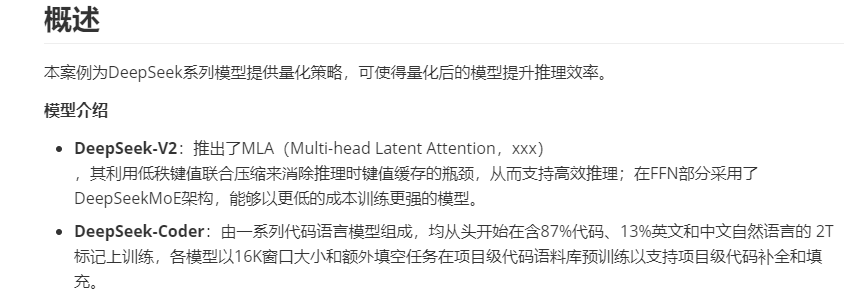

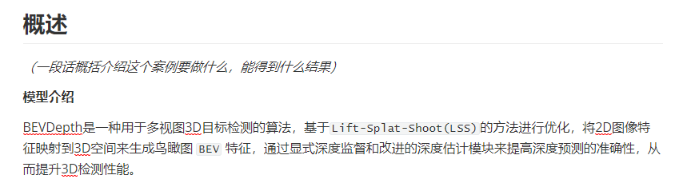

**（可选）支持任务列表**

_**资料书写要求：**_

1.  _适用于模型执行AI任务（训练&推理）案例_
2.  _提供本文介绍的模型支持的__AI任务_
3.  _表格形式，表头包括：模型、任务列表、是否支持_

**示例**

**（可选）代码实现**

_**资料书写要求：**_

1.  _适用于模型执行AI任务（训练&推理）案例_
2.  _内容包含：该案例参考的源码和在NPU上执行的代码链接_

**示例**

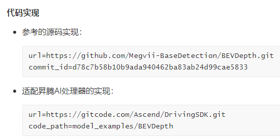

## （可选）支持模型&支持特性

_**资料书写要求：**_

1.  _适用于模型执行AI任务（训练&推理）案例或其他需要列举本案例支持的模型&特性的案例场景_
2.  _列表格式呈现，表头需要根据模型实际情况填写_

**示例**

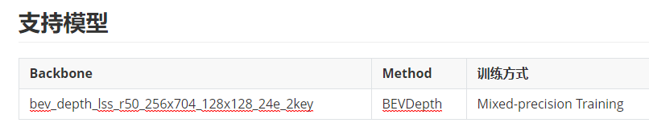

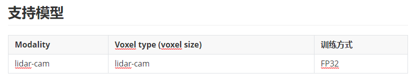

## 前期准备

_**资料书写要求：**_

_包括环境准备、数据准备（可选）、权重准备（可选）_

### 环境准备

_**资料书写要求：**_

1.  _如果下面可选章节不存在，那么可以删除环境准备的标题，直接在前期准备下描述_
2.  _用有序列表或无序列表格式描述每一条需要准备的内容（一条内容时直接用正文描述）_
3.  _涉及到需要安装依赖的，需要写出命令和安装步骤，如果需要跳转到安装指南的，用固定句式“请参见安装指南安装xxx。”_

**示例**

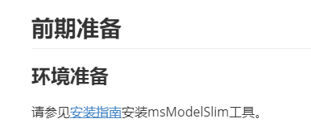

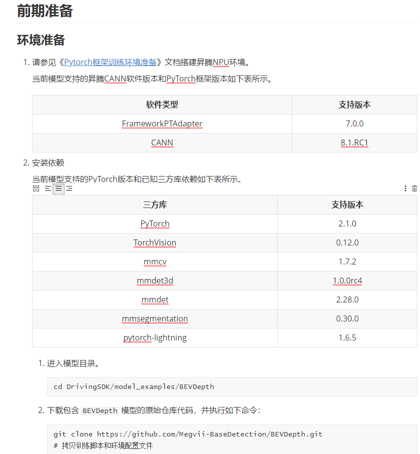

### （可选）数据准备

_**资料书写要求：**_

_用有序列表或无序列表罗列需要准备的数据，没有数据准备时就不写（没有数据准备时环境准备的标题也不需要，直接在使用前准备的标题下写环境准备的内容）_

**通用示例**

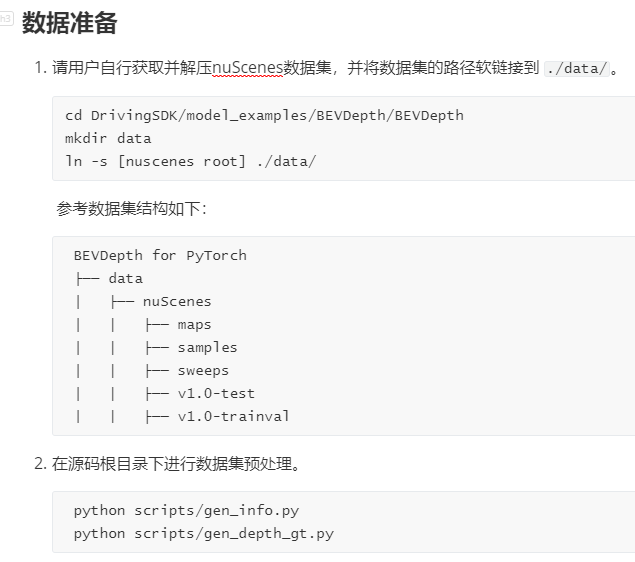

**msModelSlim模型量化的数据准备示例**

1.  _描述内容和表格均按照下列示例中固定内容，仅表格中的链接需要调整_

    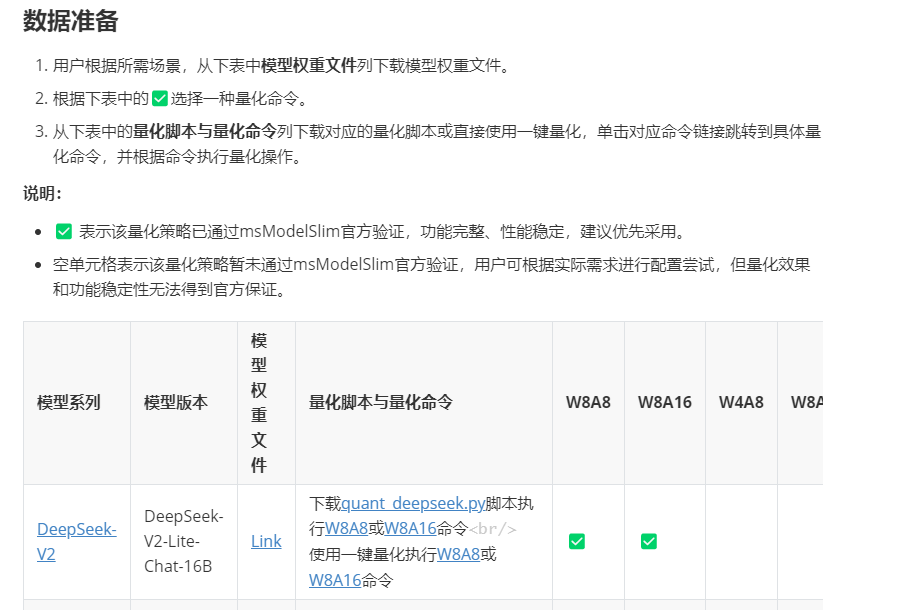

2.  _另外表格下方给出**量化脚本说明**内容为：**描述脚本的作用和结果**+无序列表列举案例中用到的量化脚本文件名并给出介绍（**一句话介绍脚本的主要功能，不超过50字**）如下截图_

    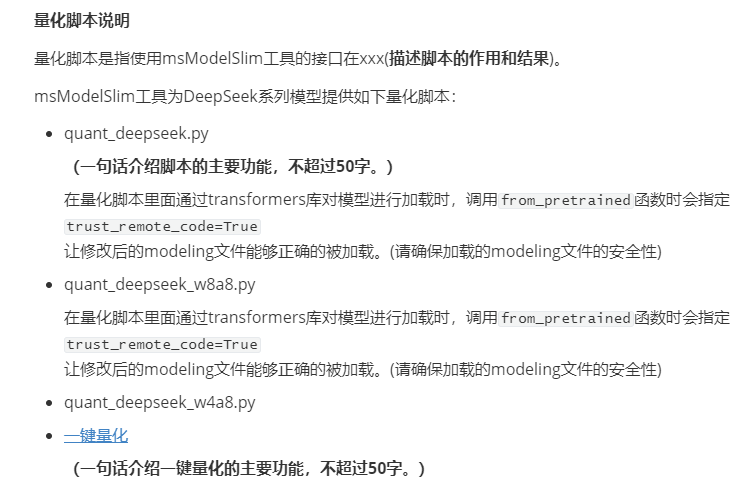

### （可选）权重准备

_**资料书写要求：**_

-   _对于需要单独下载权重文件的操作，在此章节提供权重文件下载链接_
-   _用表格呈现，表头为：模型版本、权重文件_
    -   _模型版本：为模型名称+模型版本的格式，例如DeepSeek-V3_
    -   _权重文件直接用[Link]()超链接_

**示例**

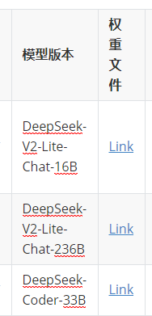

## 执行xxx

_**资料书写要求：**_

-   _标题名称根据实际操作命名_
-   _内容包括（可选）参数说明、具体操作步骤章节和结果说明_
-   _具体操作步骤章节名称根据实际情况命名__，名称不宜过长，中文标题长度不超过15个汉字，英文不超过25个字符，不允许出现特殊字符_。
-   _操作步骤若有前提条件以及子任务等，可以在步骤下增加子章节_
-   _可并列章节描述其他场景_
-   _也可以并列出现多个[执行xxx](执行xxx.md)章节_

**示例**

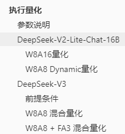

**多场景示例**

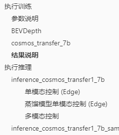

### （可选）参数说明

_**资料书写要求：**_

-   _标题下给出固定说明：_

    _以下仅提供本文中使用到的参数解释，以及xx脚本特有的参数解释。_

    _**API要有一个总体说明的md文档，这里链接到总体说明**_

-   _给出参数说明表格，表头及内容如下：_
    -   _参数：给出具体参数名称_
    -   _可选/必选：参数可选则填可选，数必选则填必选。_
    -   _说明：对参数进行解释，固定句式：参数描述，单位xx。默认值为xx。其他说明可换行描述。_

**示例**

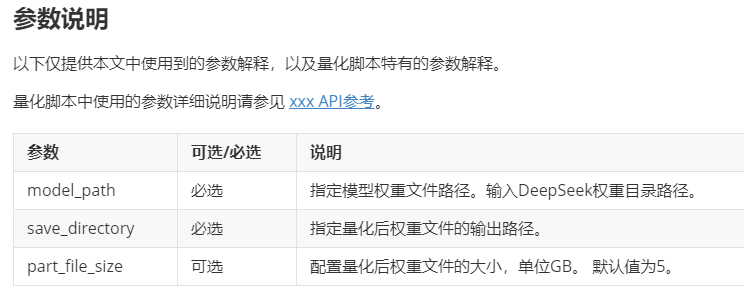

### 具体场景的操作步骤章节（可使用模型&特性名称命名）

_**资料书写要求：**_

_标题根据实际场景命名，名称不宜过长，中文标题长度不超过15个汉字，英文不超过25个字符，不允许出现特殊字符_。

**目录结构示例**

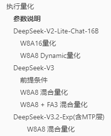

-   _内容首先一句话描述该场景的目标，再描述具体操作步骤，用有序列表表示步骤，如果只有一条命令则直接用正文。_
-   _命令行需要用代码块格式，语言为shell_
-   _操作步骤的数量最多9步，超出可根据操作的阶段拆分子章节_

**示例**

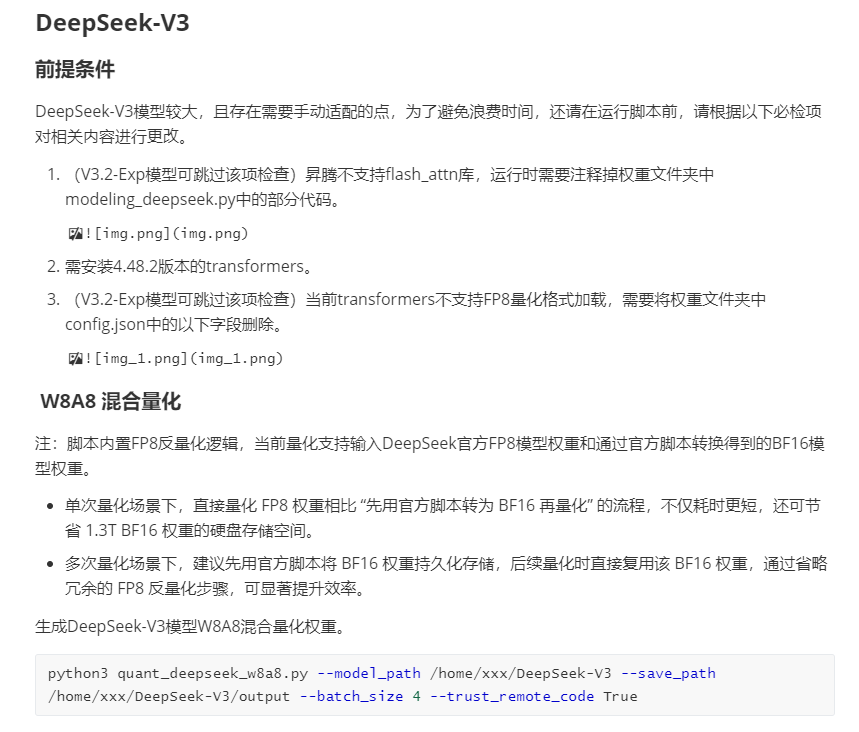

### 具体场景的操作步骤章节2（可使用模型&特性名称命名）

_**资料书写要求：**_

-   _多个场景可按顺序创建多个标题各自描述__，有操作顺序的按操作顺序，没有操作顺序的按字母序排列章节标题_

-   _如果有多个场景，且每个场景的结果不同，且各自结果需要具体呈现，则在操作步骤完成之后换行直接提供执行结果，也可以最后的**结果说明**章节进行总结_

**多场景示例**

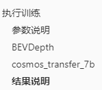

**多场景结果示例**

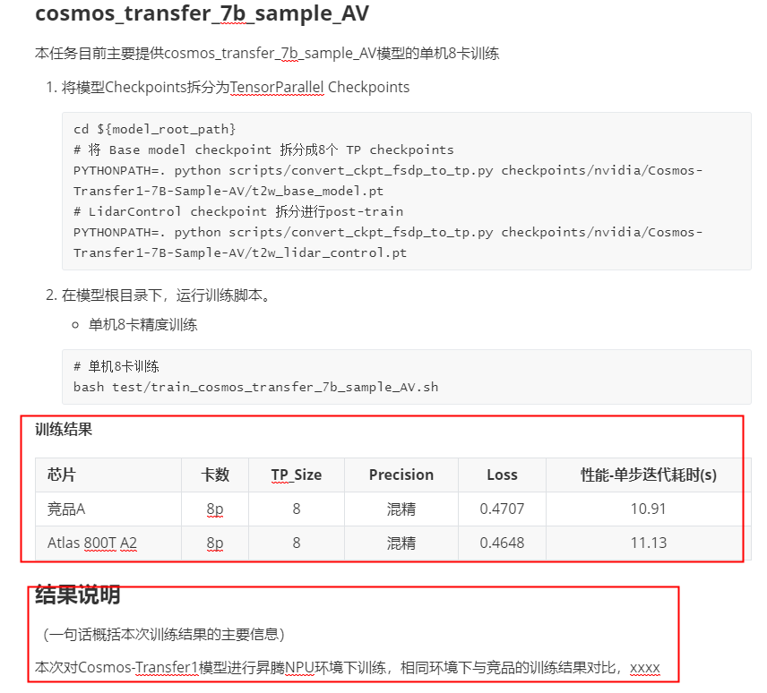

### （可选）结果说明

_**资料书写要求：**_

-   _多模型&特性场景一般在每个模型&特性的操作章节的最后提供结果说明，这里如果不需要提供总结类描述的话可不写此章节_
-   _一句话对结果进行总结，若有打屏结果则给出打屏内容示例并提供必要字段的含义解释_
-   _打屏结果用代码块格式，语言类型为空_
-   _打屏结果下方用表格提供必要字段的含义解释，表头及内容如下：_
    -   _字段：给出具体字段名称_
    -   _说明：对字段含义进行解释_

**示例**

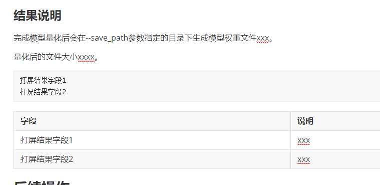

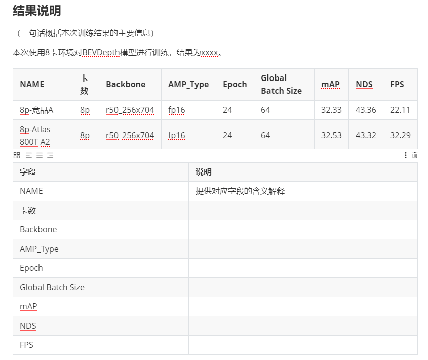

## （可选）后续操作

_**资料书写要求：**_

_直接描述得到的结果在后续可以用来做的动作，适用于一些工具执行后的结果只是在训练或推理流程中的中间结果的情况，例如量化后的模型权重文件，可用于在NPU环境下做推理，或者可以对量化后的模型做性能或精度测试等操作，再或者得到结果后需要使用结果进行分析并优化代码等操作。_

_若有具体操作的按操作步骤描述用有序列表格式_

**示例**

## （可选）结论

_**资料书写要求：**_

_一段话描述进过上述动作执行后是否达成了目标以及达成的效果__，适用于有后续操作并经过后续操作的修改后得到提升的情况_

## （可选）FAQ

_**资料书写要求：**_

-   _仅针对该样例执行过程中可能遇到到一些问题进行解答，仅在本文档中提供，不另外添加FAQ文档汇总_
-   _提供该案例执行过程中的一些问题解答，格式为：_
    -   _Q：问题描述_

        _A：解决方案_

-   _用无序列表_
-   _问题较多可用子标题分类_

**示例**

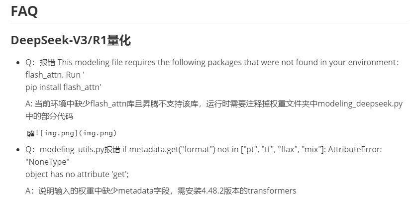

